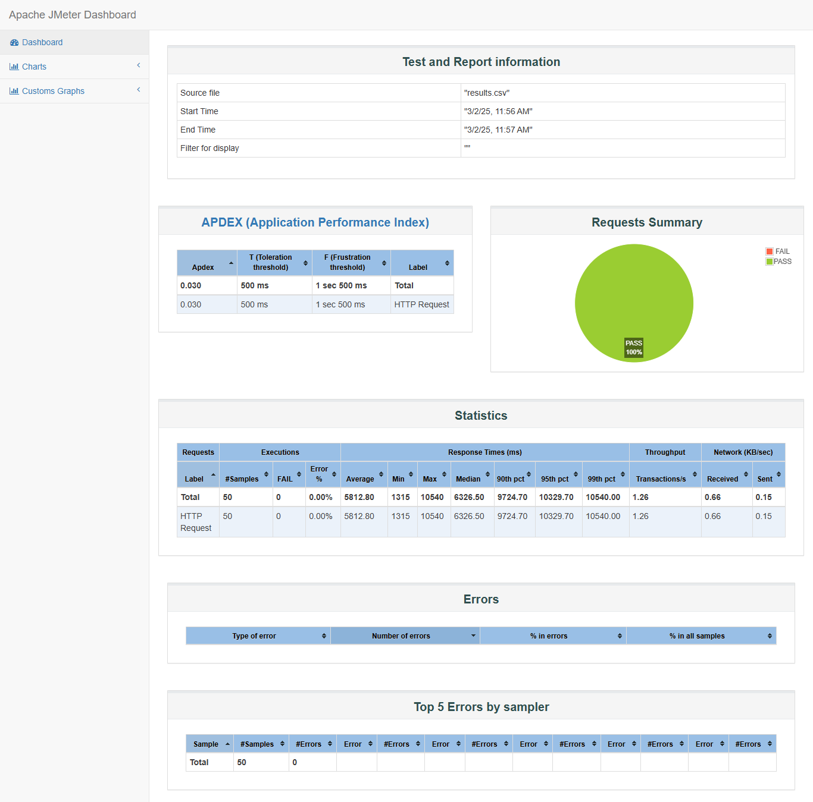

# JMeter Performance Test Report

## Overview
- **API Tested:** `https://httpbin.org/delay/{1-10}`
- **Total Requests:** 50
- **Concurrent Users:** 10
- **Each user sent:** 5 requests
- **Expected Behavior:** API introduces a **random delay between 1-10 sec** before responding.

---

## Performance Test Results
| Metric                                 | Value      | Explanation                                |
|----------------------------------------|------------|--------------------------------------------|
| **Total Requests (sampleCount)**       | 50         | Number of requests sent                    |
| **Errors (errorCount)**                | 0          | No failed requests (100% success)          |
| **Mean Response Time (ms)**            | 5812.8     | Average time per request (~5.8 sec)        |
| **Min Response Time (ms)**             | 1315       | Fastest request (~1.3 sec)                 |
| **Max Response Time (ms)**             | 10540      | Slowest request (~10.5 sec)                |
| **Throughput (req/sec)**               | 1.26       | 1.26 requests processed per second         |
| **90th Percentile Response Time (ms)** | 9724.7     | 90% of requests completed in under 9.7 sec |
| **Received Data Rate**                 | 0.660 KB/sec | 0.660 KB data received per second          |
| **Sent Data Rate**                     | 0.147 KB/sec | 0.660 KB data sent per second              |

---

## Observations & Analysis
- **API performance is stable**, with **no failed requests (0% errors)**.
- **Response times match expected delays (1-10 sec).**

---

## Screenshots of JMeter Results
### Summary Report

---
## Conclusion
- **The API handles requests efficiently** but is limited by its built-in delay mechanism.  
- **Higher user loads could lead to longer delays.**  
- **For improved performance, the API should optimize request handling to reduce latency.**  

